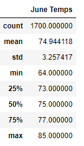
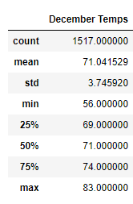
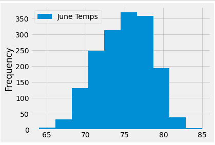
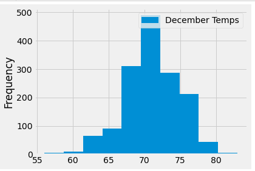

# Surf_up

## Overview of the statistical analysis

## Results

### June and December months temperature Summery Statistics

   

#### Key values:

##### Comparison of count:

- June data set has count of 1700 data values and December dataset has 1517, so December data set has less 180 records.

##### Comparison of min/max temperatures:

- According to above 2 tables, the minimum temperature in month of June is 64F and December 56F .
Keep in mind water temperature is typically about two months behind air temperature. Winter surfing is generally done in water below 50°F.
Since minimum temperature in December is 56F, W. Avy  can run his shop even in December.

##### Comparison of mean:

- The June temperatures were little over 3 degrees comparing to average temperature in December.
The December average temperature is 71 degrees and the June having an average of 74 degrees.
As it has only 3 degrees different, Oha can get considerable income even in month of December.

##### Comparison of standard Deviations:

- The June temperature data has 3.257417 std whereas the December temperature had a standard deviation of 3.745920.The December data having a higher standard deviation tells me that the December temperature data is more spread out or dispersed than the June data.

### Bar graphs for June and Deceember tempratures

  

## Summary
